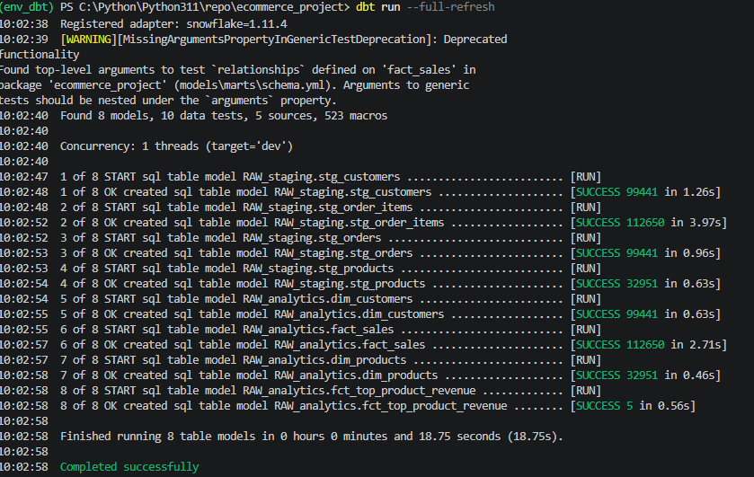
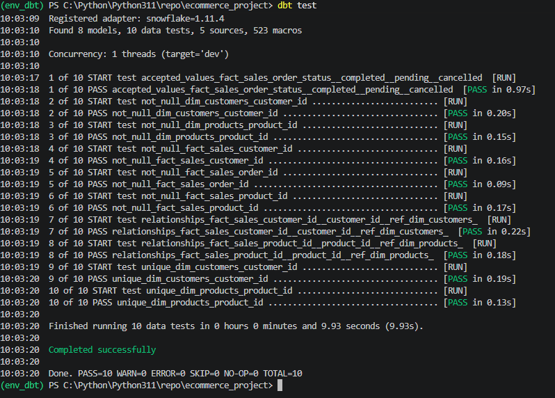
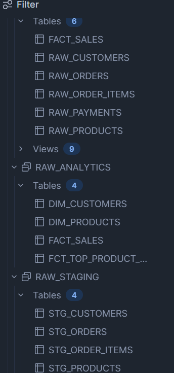
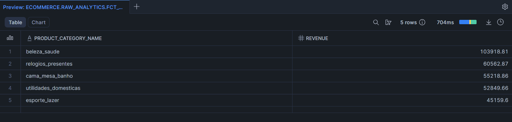

# 📊 E-Commerce Data Warehouse Project (dbt + Snowflake)

## 📌 Overview

Project ini merupakan implementasi **Data Warehouse sederhana menggunakan dbt dan Snowflake** untuk mengolah data transaksi e-commerce menjadi dataset analitik yang siap digunakan untuk reporting.

Project ini dibuat sebagai bagian dari **latihan Data Engineering (DE Test Project)** dengan fokus pada:
- Data transformation menggunakan dbt
- Data modeling (staging & fact table)
- SQL-based analytics
- Data warehouse workflow sederhana

---

## 🏗️ Architecture
            Snowflake (Raw Data)
                     ↓
            dbt Staging Models
                     ↓
            dbt Transformation Layer
                     ↓
            RAW_ANALYTICS Schema
                     ↓
            Fact Table (fact_sales)
                     ↓
            Analytics / Reporting


---

## 🗂️ Project Structure
```
models/
│
├── staging/
│ ├── stg_orders.sql
│ ├── stg_order_items.sql
│
└── marts/
└── fact_sales.sql
```

---

## 📌 Data Model

### 🔹 fact_sales
Fact table yang menggabungkan data order dan order items untuk menghasilkan dataset transaksi penjualan.

**Kolom utama:**
- order_id
- customer_id
- product_id
- order_date
- order_status
- quantity
- total_price

---

## ⚙️ Tech Stack

- ❄️ Snowflake (Data Warehouse)
- 🧱 dbt (Data Transformation Tool)
- 🐍 SQL
- 💻 Visual Studio Code

---

## 🔧 dbt Configuration

Seluruh model diarahkan ke schema berikut:

```yml
models:
  ecommerce_project:
    +schema: raw_analytics
    +materialized: table
```
## 📌 Output schema:
```
RAW_ANALYTICS
```
---
🚀 How to Run Project
1. Install dependencies
   pip install dbt-snowflake

2. Setup Snowflake connection
Edit:
~/.dbt/profiles.yml

3. Run dbt project
dbt debug
dbt run --full-refresh
dbt test

### 📈 SQL Analytics Example
#### 🔥 Top Products by Revenue
```sql
SELECT
    product_id,
    SUM(total_price) AS revenue
FROM RAW_ANALYTICS.FACT_SALES
GROUP BY product_id
ORDER BY revenue DESC
LIMIT 5;
```

### 📸 Project Evidence
#### ✅ dbt Run Success


#### ✅ dbt Test Success


#### ❄️ Snowflake Table Created


#### 📊 Top Product Revenue Result

---
### 📚 Learning Outcomes
### Dari project ini saya mempelajari:
- Konsep dbt (model, ref, transformation)
- Data modeling (fact table)
- SQL join antar dataset transaksi
- Data warehouse workflow
- Debugging dbt + Snowflake
- Best practice schema management
---
## 📊 Project Impact
#### Project ini menghasilkan:
- Dataset transaksi yang siap analisis
- Fact table terstruktur untuk reporting
- Query analytics untuk business insight (top product, revenue analysis)
- Simulasi real-world data warehouse workflow

---
### 🚀 Future Improvements
### Implement staging & marts schema separation
- Incremental models
- Data quality tests (dbt tests advanced)
- dbt documentation (dbt docs generate)
- Dashboard integration (Looker / Power BI)
---

## 👤 Author

**Name:** Reza Habibulloh  
**Role:** Data Engineer / Data Analyst  

📬 **Contact & Connect**  
🔗 LinkedIn: [https://www.linkedin.com/in/reza-habibulloh/  ](https://www.linkedin.com/in/reza-habibulloh/)<br>
📧 Email: rezadoenk28@gmail.com  
💻 GitHub: https://github.com/RezaH-art  

---

## 📬 Contact

Feel free to connect with me for collaboration or opportunities in Data Engineering / Data Analytics.
